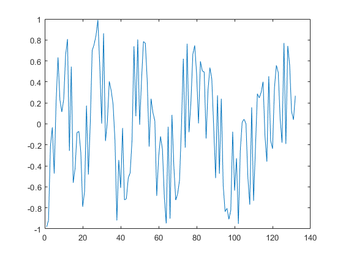
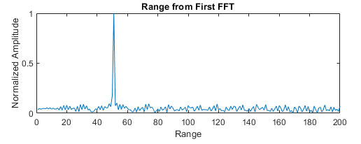
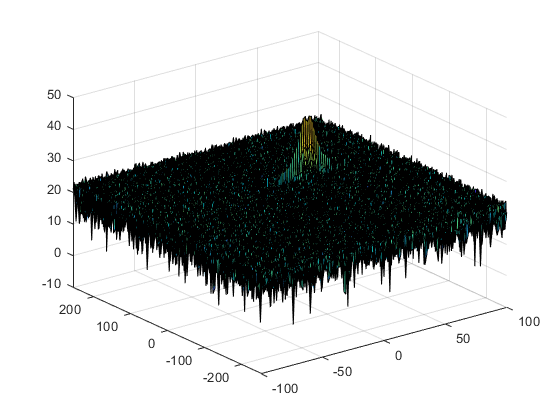
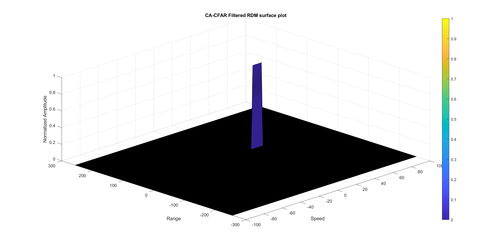

## Radar Target Generation

## Goal:

---
* Using the given system requirements, design
a FMCW waveform. Find its Bandwidth (B), chirp time (Tchirp) and slope of the chirp (k).
* User defined Range and Velocity of target to simulate the Radar range.
* Simulate Target movement and calculate the beat or mixed signal for every timestamp.
* Implement the Range FFT on the Beat or Mixed Signal and plot the result.
* Implement the 2D CFAR process on the output of 2D FFT operation, i.e the Range Doppler Map.

---

### System Specifications:

* Frequency of operation = 77GHz
* Max Range = 200m
* Range Resolution = 1 m
* Max Velocity = 100 m/s
---
### User Defined Range and Velocity of target:

* Target's initial position <span style="color:green">(pos0)</span> = ```50 meters``` 
* Target's initial velocity <span style="color:green">(vel0)</span> = ```30 m/s```  
---
### FMCW Waveform Generation:

* ```B = c / (2 * range_resolution)```
* ```Tchirp = 5.5 * 2 * range_max / c```
* ```k = B / Tchirp```

### Generated waveform:
<figure>
    
</figure>

---
### Determining the Range:

*  By performing the first FFT on the recieved Radar waveform, we can caputre Range of the target. 

#### Range FFT:
<figure>
    
</figure>

* As seen in the above figure, we accurately capture the target's position. It is shown as the peak of the FFT graph , 50 m.

---

### Range Doppler Response:

### The 2D FFT on the mixed signal (beat signal) output and generate a Range Doppler Map (RDM).

#### Range Doppler Map (RDM):
<figure>
    
</figure>

---
### 2D CFAR implementation:

* Constant value thresholding has a chance of eliminating target points if not chosen carefully.

* The main idea of this coherent processing scheme is to create an adaptive Constant False Alarm Rate (CFAR) on the 2D Range Doppler Map (RDM).

* The well-known one-dimensional cell averaging (CA) CFAR procedure suffers from masking effects in multitarget scenario and is additionally very limited in the proper choice of the reference window length. In contrast the ordered statistic (OS) CFAR is very robust in multitarget situations but requires a high computation power. Therefore two-dimensional CFAR procedure based on a combination of OS and CA-CFAR is proposed.

### Steps:

* Training cells in both range and doppler dimensions:
    
    * Tr = 10
    * Td = 8

* Guard cells in both range and doppler dimensions:
    
    * Gr = 4
    * Gd = 4

* Offset threshold by Signal-to-Noise Ratio (SNR) in dB:
    
    * Offset = 6
    
* Slide the Cell Under Test (CUT) across the 2D RDM matrix making sure that CUT has margin for training and guard cells from the edges.

* Every iteration, the signal level across the training cells is summed up and then the average is calculated.

* Offset is added to the threshold value to update the new threshold.

* CUT's signal is compared against the new threshold value.

* If the CUT's signal level is greater than the threshold, value 1 is assigned else value 0 is assigned.

* Value 0 is assigned because, the CUT is surrounded by the training cells and it does not occupy the edges, by assigning value 0 , we supress the edges.

* Finally, the 2D CA-CFAR results are plotted as an image for better visualization. 

* Note: The training cells and guard cells are chosen after multiple trials for optimal results. This can be considered as hyper paramaters to accurately fit the CFAR thresholds on the recieved Radar signal.

#### 2D CA-CFAR filtered RDM surface plot:

<figure>
    
</figure>

---
